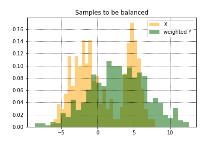
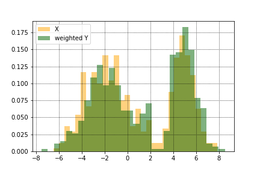
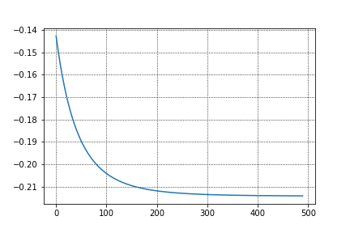

# EasyKernelBalancing

An easy implementation of Kernel Balancing by Naive Gradient Descent. (see,
e.g., Kallus 2020).

From

to

by


## Usage

```
import numpy as np
import matplotlib.pyplot as plt
%matplotlib inline
from EasyKernelBalancing import KernelBalancing

def histplot(P,Q, labelx="X"):
    plt.hist(P,density=True, alpha=0.5, bins = 30, color = "orange", label= "X")
    plt.hist(Q,density=True, alpha=0.5, bins = 30, color = "darkgreen", label= "weighted Y")
    plt.legend()
    plt.grid(linestyle="dotted", color = "black")


# A simple example
N = 500
M = 510
X = np.zeros((N,1))
for i in range(N):
    if np.random.rand() < 0.6:
        X[i,0] = np.random.normal(-2, 2,1)
    else:
        X[i,0] = np.random.normal(5, 1,1)
    

Y = np.random.normal(3,4, size = (M,1))
a = np.zeros(N) + 1./N

histplot(X,Y)
plt.title("Samples to be balanced")

# Declare KernelBalancing class
KB = KernelBalancing(X = X,
                     A = a,
                     Y = Y,
                     _lambda = 2.0
                     )
# Get Gram Matrix for Gaussian kernel automatically
KB.getGramMatrix()
# You can provide your own Gram matrix by
# KB.getGramMatrix(KXX = <YOUR_KXX>,KXY=<YOUR_KXY>, KYY= <YOUR_KYY>)

# Perform GD and get optimal weight
W_output,H_trace = KB.getOptimalWeights(learning_rate = 1e-4,
                                        max_iter = 500,
                                        epsilon = 1e-6)

# GD curve
plt.plot(H_trace)
plt.show()

```


